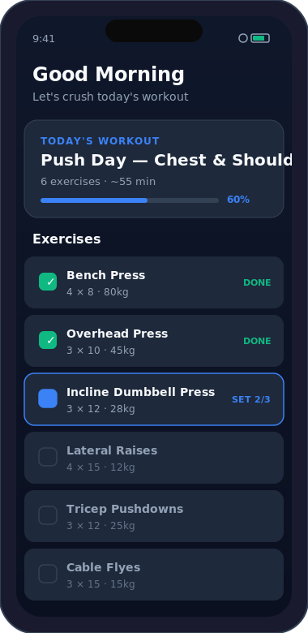
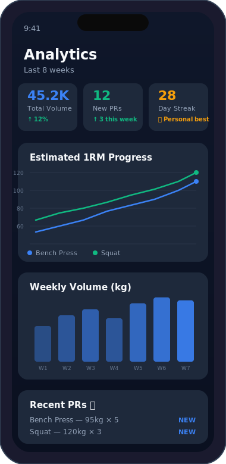
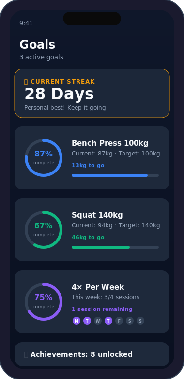

<p align="center">
  
</p>

<h1 align="center">LiftMate</h1>

<p align="center">
  A mobile-first Progressive Web App for tracking workouts, visualizing progress, and hitting your strength goals.
</p>

<p align="center">
  
  
  
  
  
  
</p>

---

## Features

- **Workout Logging** -- Log sets, reps, and weight with built-in rest timers and exercise history
- **Progress Analytics** -- Visualize strength gains with charts for volume, PRs, body weight, and weekly trends
- **Goal Tracking** -- Set strength targets with progress rings, milestone badges, and streak tracking
- **Routine Management** -- Choose from built-in routines (PPL, Upper/Lower, Full Body) or build your own
- **Progressive Overload** -- Auto-suggestions for your next session based on past performance
- **Nutrition Tracking** -- Track daily calories and macros against your targets
- **Daily Checklist** -- Configurable daily habit tracker that resets at midnight
- **Guided Warmups** -- Illustrated stretch carousels before each workout
- **Offline Support** -- Installable PWA with service worker caching; works without internet
- **Dark Theme** -- Purpose-built dark UI designed for gym use

## Screenshots

<p align="center">
  
  
  
</p>

## Tech Stack

| Layer | Technology |
|-------|-----------|
| Framework | React 19 |
| Language | TypeScript 5.9 |
| Build Tool | Vite 7 |
| Styling | Tailwind CSS 3 |
| Auth & Database | Firebase 12 (Auth + Cloud Firestore) |
| Charts | Recharts 3 |
| PWA | vite-plugin-pwa (Workbox) |
| Routing | React Router 7 |

## Getting Started

### Prerequisites

- Node.js 18+
- A Firebase project with Authentication (Google provider) and Cloud Firestore enabled

### Setup

1. **Clone the repository**

   ```bash
   git clone https://github.com/your-username/LiftMate.git
   cd LiftMate
   ```

2. **Install dependencies**

   ```bash
   npm install
   ```

3. **Configure Firebase**

   Create a `.env.local` file in the project root:

   ```env
   VITE_FIREBASE_API_KEY=your-api-key
   VITE_FIREBASE_AUTH_DOMAIN=your-project.firebaseapp.com
   VITE_FIREBASE_PROJECT_ID=your-project-id
   VITE_FIREBASE_STORAGE_BUCKET=your-project.firebasestorage.app
   VITE_FIREBASE_MESSAGING_SENDER_ID=your-sender-id
   VITE_FIREBASE_APP_ID=your-app-id
   ```

4. **Deploy Firestore security rules** (optional)

   ```bash
   firebase deploy --only firestore:rules
   ```

5. **Start the dev server**

   ```bash
   npm run dev
   ```

### Build for Production

```bash
npm run build
npm run preview   # preview the production build locally
```

## Project Structure

```
src/
  components/
    analytics/     # Charts, calendar, stats
    goals/         # Goal cards, forms, milestones
    nutrition/     # Macro tracking UI
    today/         # Dashboard widgets
    ui/            # Reusable UI components
    workout/       # Exercise tracking, warmups
  contexts/        # Auth and workout state
  data/            # Default routines, exercises, seed data
  hooks/           # useAuth, useFirestore, useTimer
  lib/             # Firebase initialization
  pages/           # Route-level page components
  types/           # TypeScript interfaces
  utils/           # Date helpers, equipment mappings
```

## License

This project is provided as-is for personal use. See [LICENSE](LICENSE) for details.
